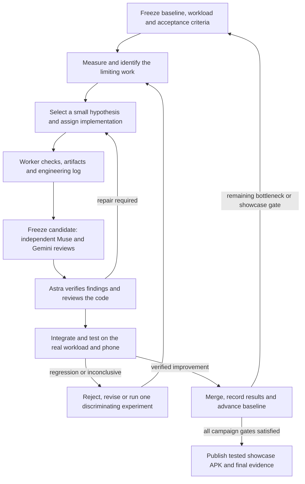

# Performance optimization campaign — execution handoff

Status: **planned, not implemented**. Written by the lead on 2026-09-08 after the
owner explicitly requested planning the actual work, not delegating plan writing.
Baseline release: v0.3.0, source `2ce6ce3157e791ab6dd49ed00cd865ee5c1cacc6`.

## Start here in a fresh session

Execute this plan as an iterative engineering campaign. Read repository AGENTS.md,
[STATUS](STATUS.md), this document, [task assignments](PERFORMANCE_TASKS.md),
[showcase specification](SHOWCASE.md), [benchmark protocol](BENCHMARKS.md) and the
current installed `multi-model-orchestration` skill. Inspect current Git/device
state before assuming the baseline is still current. Preserve intervening work.
Do not restart planning or dispatch agents to write another plan.

The owner authorizes extensive bounded subagent implementation and experiments,
PR creation/review/merge and GitHub APK prereleases. Use every model in the roster
on real tasks and record the outcomes. Do not buy subscriptions, replenish paid
credits, bypass limits, change credentials or publish a store release. Continue
independent work when one route or the phone is unavailable; label its gate pending.

Deliver both (1) measured overall engine optimization and (2) the small, highly
detailed, dense, lush alien showcase below. The showcase is mandatory, not an
optional future demo. Do not call the campaign complete with only an optimized
empty scene, instrumentation, a backlog or a host preview.

## Required outputs and preserved behavior

- A native Android APK with improvements demonstrated on the OnePlus 13, plus
  comparisons showing where performance improved, regressed or stayed inconclusive.
- The explorable [showcase](SHOWCASE.md): high voxel count, dense vegetation,
  recognizable modeled mushrooms, water and complex terrain; original assets.
- Correct edits, queries, terrain/body collisions, save compatibility and lifecycle
  recovery throughout. Visibility/LOD/idle policies must not silently change rules.
- Versioned benchmark scenes/replays, compact reports and raw evidence with hashes.
- Per-worker engineering logs, model qualification/results ledger, lead execution
  log, accepted/rejected experiment decisions and a fresh-session handoff.
- Reviewed, checked, merged PRs; tested GitHub APK, exact build manifest and evidence.

The engine remains reusable Rust with ash/Vulkan. Rapier is the current physics
baseline. No language/backend rewrite or new physics package is justified merely
by this optimization request. Evaluate focused alternatives only against a measured
bottleneck and preserved behavior. Prototype findings are not product guarantees.

## Loop and ordering

1. **Freeze.** Give the iteration an ID, baseline/candidate source, scene/configuration
   hashes, one principal hypothesis, primary metric, correctness/quality guards,
   allowed files, resource limits and stopping rule. Candidate-dependent interface
   decisions must be settled before dependent writers start.
2. **Measure.** Use a source hypothesis to choose a discriminating measurement;
   source inspection alone does not establish a bottleneck. Separate CPU busy time,
   elapsed stages, GPU execution intervals, synchronization waits and presentation.
3. **Implement.** Normally run an Opus engine worker plus one or two independent
   Muse/GLM/Hy4 workers. One causal optimization per candidate; integrate interacting
   changes serially so their individual and combined effects remain attributable.
4. **Worker handoff.** Require artifact fingerprint, relevant diff, definition-of-done
   results and engineering log. Verify the runner and children are stopped. Freeze
   the candidate before reviewers begin; workers do not modify reviewed files.
5. **Swarm review first.** Run independent Muse/Gemini reviews against that exact
   candidate before Astra's substantive code review. Reviewers do not see each
   other's findings initially. See the review protocol below.
6. **Lead review.** Astra independently checks the changed code, invariants and
   integration seams, verifies candidate findings, and resolves disagreements using
   reproductions or explicit evidence. A reviewer vote is not acceptance.
7. **Verify.** Run relevant host tests/validation, then matched phone measurements
   and visual/interaction checks. A host win does not qualify a mobile optimization.
8. **Decide.** Accept, reject, revise or mark inconclusive with evidence. A corrective
   patch changes the candidate fingerprint and needs review of the correction and
   affected invariants. Do not rerun unrelated checks indefinitely.
9. **Advance.** Merge only accepted work after required checks. Update the baseline,
   task/model ledger and docs; publish useful tested checkpoints. Repeat from the
   highest remaining measured cost or unmet showcase requirement.

## Model roster and actual qualification

Use the installed Pi profiles, not improvised CLIs or API model aliases. Recheck
exact provider/model/effort and account capacity at execution time. Preserve the
working provider extensions. Current intended roster:

| Model / profile | Main campaign role | First real qualification |
|---|---|---|
| Opus 5 / `opus-medium`, medium | Main engine implementation workhorse: invalidation, data/render interfaces, streaming and integration-ready optimization patches | P02: dynamic-object change tracking/reuse with independent regressions |
| Muse Contributor Free / `muse-free`, high | Largest share of parallel bounded implementation: fixtures, assets, scene generation, tests, useful local optimizations and reviews | P01 fixture/replay slice, then P04 mushroom generator and review findings |
| GLM 5.3 Flash / `glm-high`, high only | Localized tools, workload manifests, scene statistics and regression fixtures | P01 manifest/measurement validator with deliberately invalid inputs |
| Tencent Hy4 / `hy4-openrouter`, high | Bounded paid implementation alternate; original voxel flora and one independent optimization experiment | P04 isolated mushroom prototype with geometry/material validation |
| Gemini 3.8 Flash / `gemini-restricted`, high | Read-only candidate code reviews, test-gap searches and visual critique after image-input qualification | Review a frozen implementation; verify each finding or record none/false positives |
| Astra / lead high, Pi `astra-worker` medium when useful | Architecture, integration, final acceptance; focused additional audit of consequential ownership/lifetime changes | Final code/integration review; one bounded Pi lifetime audit when that risk exists |

All six models must receive useful real work, not only identity/nonce probes, before
claiming the all-model evaluation complete. A failed/unavailable model remains an
honestly recorded result; it does not prevent delivery through another route.
No minimum code contribution or equal spending is required from each model.
Gemini does not own critical implementation or final acceptance. Astra high owns
coordination; expensive xhigh consultation is exceptional, not routine swarm work.

Start with a bounded task per unqualified route, then increase responsibility only
where accepted output supports it. Observe: exact route/harness/version, task/base,
worker elapsed time, checks, useful output, errors, accepted/withdrawn findings,
repair/review effort and evidence. Distinguish repeated cached input from largest
request context, output tokens, estimated cost and actual quota/cash. Unknown stays
unknown; zero provider placeholders do not prove free usage. Do not rank different
models simply by times or defect counts from tasks of different difficulty.

Use existing authorized subscriptions/credits. Check the available paid balance and
set an explicit Hy4 per-attempt and campaign credit ceiling before paid execution;
ask the owner for the ceiling if absent. A Pi wall-time timeout is not a cash cap.
If the route cannot enforce the needed ceiling, keep paid work pending while free
and subscription lanes proceed. No automatic top-ups or paid fallback. Reserve
lead capacity for review, repair, recovery and release rather than exhausting it
on worker retries. One bounded correction is the default; continue only with new
information and plausible value, otherwise reroute and record why.

## Concurrency, ownership and board

Use **at most three active workers plus the lead initially**, or fewer if the actual
host/provider limit is lower. All Pi processes and any authorized descendants count.
Extensive use means successive useful waves; it does not require dozens of concurrent
writers. Count reviews too. Serialize phone access, GPU captures and large Android
builds under the lead. Avoid parallel builds competing for memory/shared targets.

Create a new campaign run; the v0.3 board is closed history. Keep one canonical live
assignment authority. Reuse the existing bounded board only after P00 verifies Pi
attempt identity, cancellation/recovery and the new patch/log handoff contract.
The current board expects clean committed submissions; new Pi leaf briefs normally
prohibit commits. Do not silently impersonate a worker, pretend an uncommitted patch
is a clean revision, or weaken that check. P00 must select and test a minimal explicit
lead-import/freeze adapter, or use a sole lead-written compact campaign board until
that adapter is ready. Never operate two conflicting live boards. No new distributed
service or general orchestration framework is needed.

Each assignment records task/attempt/owner/profile, exact baseline, unique workspace,
owned paths, interface versions/dependencies, run/session path, artifact/log path,
state and acceptance evidence. States distinguish running, submitted, review-needed,
accepted, rejected and blocked. Lead owns global docs, manifests, integration and
releases. Reviewers receive read-only frozen sources and separate output locations.

Retain v0.3's useful bounds: scoped startup view <=6 KiB, status <=2 KiB, messages
<=1 KiB, inbox <=4 messages/8 KiB. These are coordination bounds, not a ban on useful
long source material. Point to artifacts instead of replaying logs. Give a short
source map; checkpoint current decisions/changed files/remaining checks when history
becomes stale. Read only relevant evidence. Apply a versioned decision before
acknowledging it as done. Verify runner/children inactivity and preserve partial
changes before replacement. Resume only an exact idle session in a new attempt/run.

## Review swarm protocol

For a substantive candidate, start with **two Muse reviewers and one Gemini reviewer**
in an available wave. Split perspectives: behavior/data compatibility; concurrency,
resource lifetime/invalidation; metrics/quality/test gaps. For a small localized
change, one Muse plus one Gemini is sufficient. For broad changes, add a second
wave only for named uncovered risks; the skill's up-to-ten-per-family roster is a
ceiling, not a dispatch target. Duplicate writers reviewing their own output are
not independent review.

Every finding needs file/line, concrete trigger, consequence, supporting evidence,
uncertainty and a proposed discriminating check. No findings is valid. Gemini's
reports are candidate evidence. If image input is not verified, do not claim visual
review from that worker. All reviewers hand in engineering logs. Astra reviews
last, classifies verified/rejected/unresolved findings and inspects for omissions.
Agreement does not establish truth; verify speculative fixes before paying their
implementation or visual-quality cost. Re-review changed code after repairs.

## Measurement contract

Use [BENCHMARKS](BENCHMARKS.md), with these campaign requirements:

- Preserve the v0.3 raw baseline as history, but collect a new matched reference.
  Its USB-powered, already-hot, severe-throttling run cannot be the causal comparator.
- Use wireless debugging on a trusted network where available and physically
  disconnect charging. Verify actual USB/AC/wireless power state. Do not treat a
  simulated battery-service state as disabled charging or invent charge-control paths.
  Ask for physical unplug/pairing assistance only when actually needed.
- Freeze brightness, output/internal resolution, refresh policy, quality, seed,
  camera/input replay, body/vegetation counts, build flags, profiling mode and OS mode.
  Record case/ambient conditions. Start matched pairs with the same thermal status
  (prefer no throttling), battery temperature within1°C and skin within2°C when
  available; require stable readings for two minutes. These are initial comparison
  tolerances, not evidence of equal electrical power. Report exceptions/inconclusive pairs.
- Measure CPU busy time with available thread/process clocks or a qualified trace,
  separately from wall time. Mark acquire/fence/present waits explicitly. Add work
  counters for physics active/sleeping bodies, mesh generation/uploads, shadow passes,
  saves, allocations/retained capacity, preparation queues and collision publication.
  Positive stage duration alone does not mean useful work occurred.
- Keep redraw, submitted-frame, GPU-completed-frame and actual-presentation identities
  distinct. Retry draws must remain visible. A present API call is not a scanout
  timestamp. Do not fabricate a CPU/GPU/compositor join where IDs/clocks lack a mapping.
  Qualify new timestamp boundaries and measure instrumentation overhead on the phone.
- Report p50/p95/p99, >33.3/>50/>100ms intervals, missing-sample coverage, startup and
  edit-to-visible/collision latency, process/graphics memory and queue/retirement peaks.
  Track temperature/throttle transitions. Battery percent alone is not energy; use
  calibrated available energy/current telemetry or mark energy unknown.
- Use short matched A/B screens first (initially3 alternating pairs of60–120 seconds,
  after documented warmup/cooldown). Compare run-level results and observed noise;
  thousands of correlated frames are not thousands of independent experimental runs.
  Only finalists require20-minute sustained captures after120s warmup, with matching
  reference conditions and repeats where comparative claims need them.
- Fixed-quality work reduction, frame-cap/idle scheduling, quality adaptation and
  alternative build profiles are separate experiments. Never hide reduced resolution,
  vegetation, voxel detail or simulation behind an 'optimization' label.

Initial acceptance rule: correctness/visual gates pass, primary improvement exceeds
both5% and the measured same-build variation for that metric, and no guarded metric
shows a repeatable >5% regression outside noise. This is a working decision rule,
not a promised win or statistical confidence claim. Explicit tradeoffs require
separate reporting and a justified acceptance decision; otherwise reject or defer.
Calibrate sensible tolerances for memory, latency and images before the experiment,
not after seeing results. Do not optimize the smoothed HUD counter.

## Workloads, phases and stopping rules

Always retain a small diagnostic scene, but add increasing portions of the showcase
from the first content iteration. Mandatory workloads: cold launch/load; settled
stationary view; slow look/walk; fast travel and reversal;64-body fracture/settling;
terrain edits and saves; showcase water/vegetation vistas; foreground/background,
resume/recreation; bounded memory-pressure and repeated reset/load cycles.

Execution order is [P00–P07](PERFORMANCE_TASKS.md): trustworthy instrumentation and
qualification; idle/dynamic work reduction; representative showcase tile and fine
voxel representation; full dense showcase; active streaming/render/memory work;
water/material polish; final combined regression and release. Independent asset and
test lanes can overlap engine work once interfaces are fixed. Do not defer all art
until optimization ends; conversely, do not build millions of detail cells using
an unbounded prototype layout before resource limits are checked.

Stop an individual experiment after its defined failure, deadline, qualifying win
or one informative follow-up. Reject fixes that only relocate waits or reduce work
by breaking responsiveness, simulation, geometry or quality. After two inconclusive
iterations on the same bottleneck, return to attribution or choose another measured
cost; do not keep speculative rewrites alive. Pause dispatch on quota/provider
failure and retain artifacts. End a work block with a usable checkpoint if external
conditions require it, explicitly listing outstanding deliverables.

Campaign completion requires all showcase gates, matched phone evidence for accepted
optimizations, no unresolved release-blocking correctness/lifetime defects, all-model
qualification outcomes, passed relevant CI and a published testable APK. Aim for a
60Hz responsive profile (p95<=16.67ms, p99<=25ms) on a declared fixed configuration;
this is an engineering target, not an achieved result. If it is not met, publish the
actual result/remaining bottleneck and do not claim the performance target complete.
An explicit30Hz fidelity profile can be evaluated separately; it must not silently
replace the responsive target. No universal flagship/device claim follows from one phone.

## Logging and fresh-session continuity

Each implementation brief includes outcome/exclusions, verified fixture facts,
owned files/interfaces, measurable definition of done, worker-vs-lead checks, limits,
stop condition and a unique engineering-log path. Logs record Actions Taken,
Issues & Friction, Decisions & Rationale, Solutions Applied and Insights at major
steps. Handoffs include pass/fail/not-run evidence and a concise log summary.
Read-only workers return entries in their final response for the lead to preserve.

Keep the live assignment snapshot small. Keep the lead execution log and accepted
experiment/model summaries in Git; retain larger captures/worker sessions under
`/mnt/bench`, with appropriate release artifacts and hashes. No raw provider sessions
in the skill repo or public evidence bundle. Update STATUS with exact shipped work,
next runnable task, unresolved gates and device ownership. Release manifests identify
source, build flags, test conditions, signing identity and APK checksum. Preserve
user saves and restore the user's scene after tests. Remove unused private temporary
build targets only after their processes stop; preserve shared caches.
