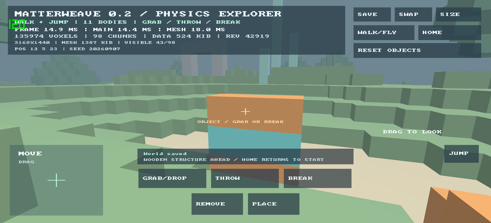

# v0.2 build, host and OnePlus 13 evidence

Date: 2026-09-07. Source: the integrated v0.2.0 release tag; the release build
manifest records the exact source revision. This report covers functional tests,
not a controlled sustained-performance comparison.

## Device and build

- OnePlus 13, model CPH2653; Android 16/API 36.
- LineageOS `23.2-20260818-NIGHTLY-dodge`, kernel `6.6.142-4k-g999b95d4792d`.
- Firmware fingerprint `OnePlus/CPH2653EEA/OP5D55L1:16/BP2A.250605.015/V.R4T3.52da06f-2e397f6-2e81775:user/release-keys`.
- Queried Adreno (TM) 830, Vulkan 1.3.284, driver 2150760522, vendor 0x5143,
  device 0x44050001. Queried heaps are capacities, not free memory.
- Render extent 3168×1440, seed 20260907, Rust dev profile optimization level 2,
  debug assertions enabled, ARM64/API 28 native target. Phone connected over USB
  and charging; normal OS refresh policy, no controlled thermal baseline.
- APK SHA-256 `d0b68ba05486c5f9fe98d89eae5b4ba8d1968ccf1d81dee01608f6c23fc9648b`.
- Debug certificate SHA-256 `38129e42b55975af08bf090ef7ca45d86234f13954aa755361405020c6fe28c9`, matching published v0.1.

## Executed checks

`cargo test --workspace --locked`: 51 passing tests (22 core, 14 app, 11 physics,
4 renderer). `cargo fmt --all -- --check`, workspace Clippy with `-D warnings`,
`python3 tools/check_docs.py`, dependency inventory regeneration, Android
`:app:assembleDebug`, `tools/verify_apk.py`, official `zipalign -c -P 16 4` and
`apksigner verify --verbose` passed. The unchanged upstream X11 cast warning is
reported as a vendored dependency warning; it is not suppressed by a source patch.

The core geometry fixture (seed 8712 plus three edits) has identical exposed
unit faces/materials and correct outward winding: reference 27,744 triangles,
greedy 6,660. This measures geometry count, not frame time. A 64-body stack survives
600 fixed 1/60-second solver steps with supported finite/restorable state.

The [host log](2026-09-07-v0.2-host.log) records 30 presented llvmpipe frames with
validation enabled, actual app edits/object actions/save/reload, resize and
window/renderer recreation. The [cache log](2026-09-07-v0.2-cache.log) separately
exercises GPU buffer replacement/eviction and dynamic capacity reuse. Neither
log contains Vulkan validation errors. Host GPU: llvmpipe Vulkan 1.4.318, driver
104865800; Mesa software rendering is supporting correctness evidence only.

## Physical interaction and persistence

The owner authorized USB testing and accepted Android's debugging prompt. Host
USB access was granted to this attached USB node; no device security setting or
project signing key was changed. The original app files directory was backed up
before testing and contained no saved world. Successive development APKs installed
with `adb install -r`; the existing application identity was preserved.

Sequential ADB touchscreen gestures exercised the actual touch input path:

- Walking changed the saved eye from (12, 4.517, 23) to approximately
  (11.518, 3.510, 18.742), with gravity/terrain support.
- A 150 ms JUMP hold raised the saved eye by 1.283 units before landing.
- GRAB moved a real crate on the spring constraint. THROW saved a body with
  linear speed 13.157 units/second. BREAK changed 11 bodies to 18, with exactly
  eight `[1, 1, 1]` half-meter pieces.
- Flight traveled beyond the original ±32 island to roughly (-8.240, 7.939,
  -63.002). PLACE added one authoritative chunk override (32 → 33).
  An APK update/cold launch and explicit SAVE retained identical authoritative
  chunk contents, exactly the saved camera position and all 18 bodies.
- HOME returned to the demo and RESET OBJECTS restored eleven crates while
  retaining terrain edits. The final screenshot shows the object aim indicator.

## Lifecycle findings and verification

Repeated explicit v0.1 launches exposed `ndk-context`'s `previous.is_none()` panic:
a second standard NativeActivity attempted to initialize a process-global context.
v0.2 uses a singleTask root activity; repeat launch routes to the existing instance.
[Android launch-mode documentation](https://developer.android.com/guide/topics/manifest/activity-element#lmode)
explains this behavior. Normal user v0.1 operation had previously been reported
successful; this finding was discovered during the more aggressive launch test.

Source review also found that winit 0.30.12 ignored activity destruction and
prohibited sequential event-loop recreation. Compatible 0.30.13 still contained
both limitations. The [documented two-file patch](../../vendor/winit/MATTERWEAVE-PATCH.md)
handles Destroy and releases the Android loop-creation guard after platform fields
drop. Explicit logical Back handling closes the app instead of consuming the key.

Three cycles each of Home/resume and Back/relaunch passed after the fixes. Back
recreated the Activity and graphics resources in the **same process**, with warm
launches reporting 52, 63 and 55 ms; these are OS launch observations, not frame
benchmarks. No repeated-context panic or event-loop recreation error occurred.
[Device application log](2026-09-07-v0.2-device.log) records resumed/suspended,
graphics recreation and saved state. Display rotation overrides 3 and 1 were
confirmed by WindowManager; both landscape views remained upright and SAVE still
worked. Original `free`/`default` rotation settings were restored.

## Unmeasured / untested

No physical simultaneous multi-finger input, secure lock/unlock, low-memory-kill
stress, mobile Vulkan validation layer, GPU timestamps, controlled power/thermal
run or cross-device comparison. Sequential ADB gestures and host multitouch unit
tests do not establish physical concurrent input. The visible OS `120` overlay is
display refresh, not measured application FPS. Intermediate diagnostic wall-time
samples are not a sustained-performance claim. Full M2/M3 gates remain open.
