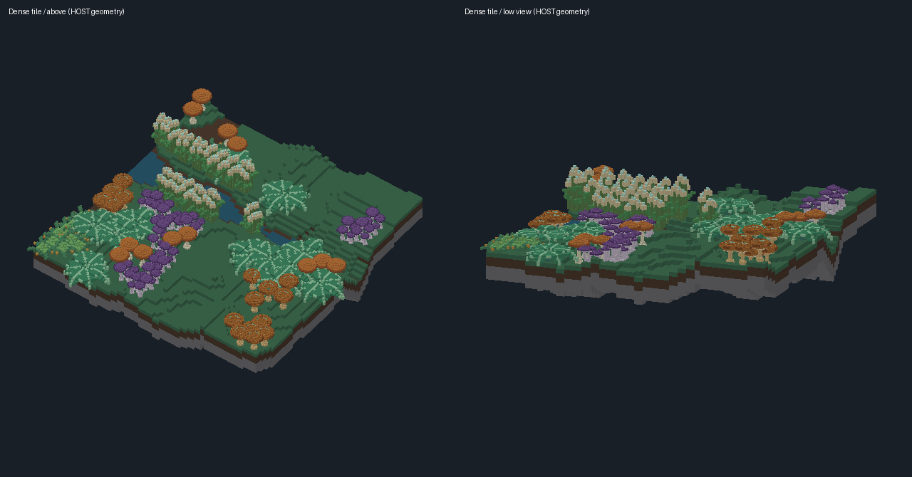
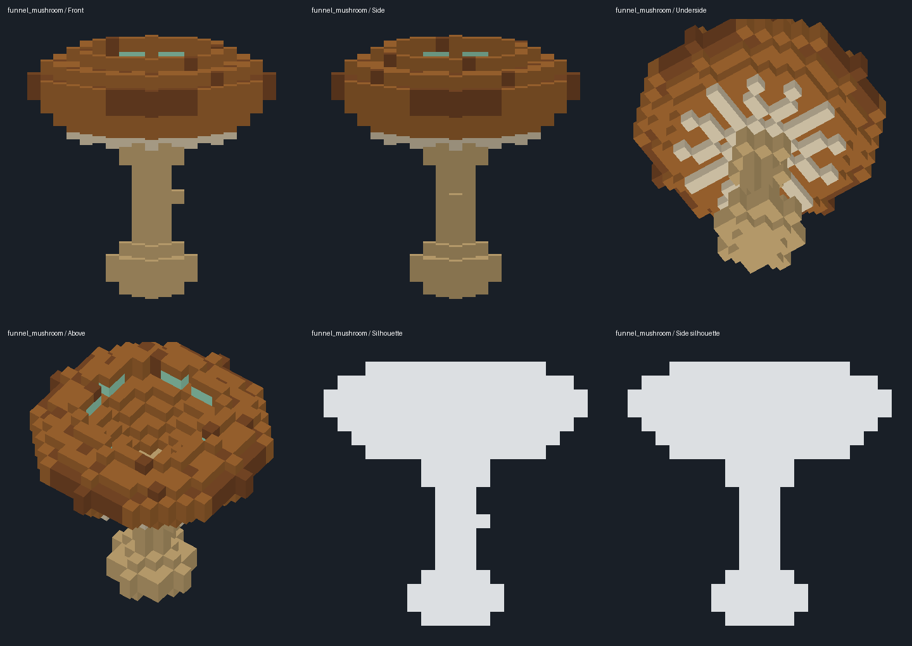

# Flora source acceptance

Source commit `64661cf` on `codex/performance-flora`, based on `f9251d7` (the source
foundation already merged through PR #6). Canonical flora generator 2, terrain generator
1, seed 20260908. This is acceptance for native integration, not an APK, complete showcase
or performance acceptance.

## What problem this solves

The flora catalogue and dense tile need independent source, count and mesh checks before
native integration, and an explicit statement of what the host images can and cannot show.

## How it works

The checks run the full detail crate test suite, strict lint/format, the release example
export, and independent validators over the exported gallery. The [manifest](manifest.json)
records individual placements, support, bounds, counts, materials, policies, budget
exclusions and version numbers. The geometry inspector reconstructs source voxels
independently of the placement helper and compares transformed root/voxel centres with the
terrain.

## What was verified

| Check | Result | Evidence |
| --- | --- | --- |
| All detail crate tests | PASS: 50 (1 unit, 34 existing integration, 15 flora) | [test output](logs/final-tests.log) |
| All-target Clippy with warnings denied | PASS | [lint output](logs/final-clippy.log) |
| Crate formatting and Git whitespace | PASS | Lead execution |
| Release example export | PASS | [export output](logs/final-export.log) |
| Independent source/count/mesh validation | PASS, 21 meshes | [gallery check](gallery-check.json) |
| Independent rooted contacts, source connectivity and terrain clearance | PASS, 84 plants | [geometry check](geometry-check.json) |
| Inspector negative controls | Candidate02's disconnected/intersecting geometry rejected; final-scene raised-root mutation rejected | Lead execution |
| Independent Muse and Gemini source reviews | Completed, verified issues repaired | [Muse](logs/muse-flora-review.md), [Gemini](logs/gemini-flora-review.md) |
| Muse correction review | Completed, no remaining regression found in correction scope | [review](logs/muse-flora-delta.md) |
| Native rendering, traversal, collision adapter, mobile cost | NOT RUN by this lane | Sole integration lead owns these gates |

The tests cover actual anatomy, connected roots, palette policy, deterministic scene and
source generation, source round trips, unchanged source across LOD, fractional and
negative transforms, footprint support, higher-bank interference, minimum counts and
retained mesh capacity. Host tests are not native evidence.

### Final exported content

| Measure | Actual |
| --- | ---: |
| Flora / terrain instances | 84 / 1 |
| Flora types / total prototypes | 6 / 7 |
| Unique stored occupied cells | 28,908 |
| Instance-expanded flora occupied cells | 52,686 |
| Terrain occupied cells | 25,124 |
| Total instance-expanded occupied cells | 77,810 |
| Source payload bytes | 286,720 |
| Retained cached mesh bytes, all three LODs | 1,750,896 |
| Exported snapshot bytes | 90,615 |

Per-source flora cells: clustered mushroom 912; fan frond 422; funnel mushroom 1,106;
existing parasol 938; reed cluster 297; rosette 109. All six are one six-neighbour
connected component reaching local y = 0. All prototypes remain below the existing
conservative mesh limit. Prototype reuse, not unique allocation per plant, accounts for
the difference between stored and expanded counts.

Scene generation took about 2.006 s in one host release run. This is an uncontrolled host
observation with concurrent integration activity, not an optimization comparison or a
phone estimate. It identifies generation as a native-loading concern: do not regenerate
this fixture per frame. Cache the scene and meshes; assess load latency in the native
adapter. Detailed timings, host/build identity and hashes are in [evidence.json](evidence.json).

### Visual judgment

The lead inspected Source front, side, underside, above and silhouettes, fixed-framing LOD
comparisons, and the composed tile. Mushrooms retain recognizable cap/stipe profiles,
actual underside gills, a funnel depression and distinct clustered crowns. The corrected
fan has connected broad blades; rosette tips remain connected. The scene has distinct
plant groups and a creek. Its deliberately repeated prototypes and tile-scale relief are a
test workload, not final whole-map art acceptance.

Half and Quarter lose thin anatomy and can merge mushroom features. They are valid derived
meshes but are **not visually approved for close views**. Native evaluation should
initially use Source. Lighting here is a small orthographic host renderer with two-sided
simple shading, not the Android shader or proof of temporal stability. Optional
reproduction uses `render_flora.py GALLERY_DIR` beside `mesh_views.py` with NumPy and
Pillow; camera conditions are retained in
[view conditions](images/view-conditions.json).

## Limits and what is open

Native rendering, traversal, the collision adapter and mobile cost are not covered by this
lane's evidence. Consume the source commit plus this evidence commit; preserve the user's
saves, and evaluate native source gallery loading and rendering before claiming density or
thermal improvements. No changed product requirement or accepted architectural decision is
implied.
