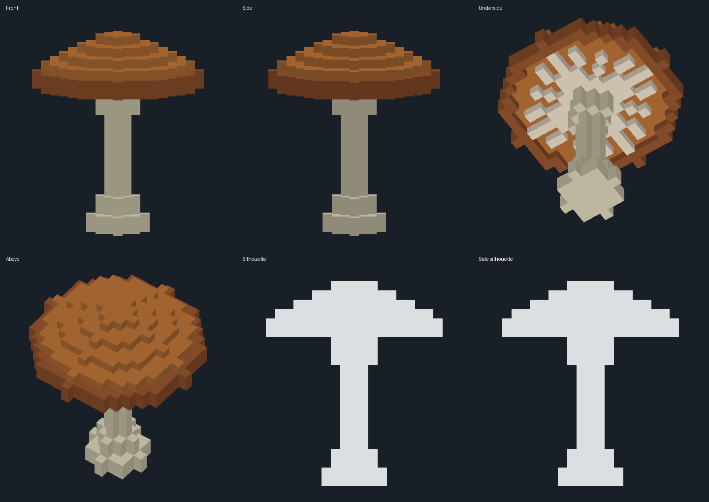
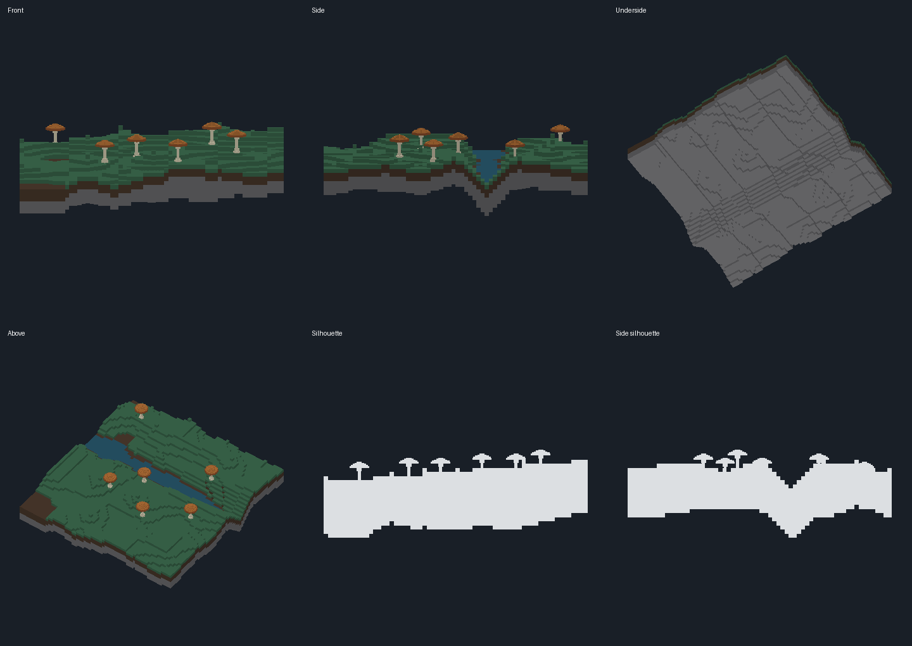

# P03 source foundation verification

Source candidate `37e28a2` on `codex/performance-detail`, based on main `94dc2ca`. This is
a host-verified source/mesh adapter foundation. Native integration, phone
appearance/collision/cost, a dense representative tile and full P03 acceptance remain
outstanding. The sparse gallery is not the required final showcase.

## What problem this solves

The detail source and mesh adapter need independent, reproducible checks before native
integration, separate from the host measurements that cannot prove native quality.

## How it works

Reproduce source/mesh checks from the repository root, with build and output locations on
`/mnt/bench`:

```bash
CARGO_TARGET_DIR=/mnt/bench/matterweave-dev/performance/desktop-01/target cargo test -p matterweave-detail --locked
CARGO_TARGET_DIR=/mnt/bench/matterweave-dev/performance/desktop-01/target cargo clippy -p matterweave-detail --all-targets --locked -- -D warnings
cargo fmt -p matterweave-detail --check
CARGO_TARGET_DIR=/mnt/bench/matterweave-dev/performance/desktop-01/target cargo run -p matterweave-detail --example detail_gallery --locked -- /mnt/bench/matterweave-dev/performance/desktop-01/reproduced-gallery
python3 docs/performance/p03/validate_gallery.py /mnt/bench/matterweave-dev/performance/desktop-01/reproduced-gallery
python3 tools/check_docs.py
```

The [small artifact manifest](gallery-check.json) records exact source/mesh SHA256 and the
canonical instance-composition hash.

## What was verified

| Check | Actual result |
| --- | --- |
| Focused Rust behavior checks | 35 PASS: 1 placement unit test, 34 integration tests. |
| Clippy / formatting | PASS, all targets in the new crate, warnings denied. |
| Exported source/mesh oracle | PASS: unique/expanded counts, duplicate-source rejection, buffer sizes, indices, winding and source exposed-surface area. |
| Oracle negative checks | Incorrect count, overlapping source runs, invalid index and reversed winding all rejected. |
| Repeat generation | Source snapshots, mesh bytes, instance composition and deterministic manifest reproduced; timing is separate. |
| Foot support | All bottom-foot cell centres for six placements have 0.0 m gap and no water column, independently checked from exports. |
| Standalone host memory | Final gallery process maximum RSS 3936 KiB, elapsed 0.08 s (`/usr/bin/time -v`); no renderer/GPU/Android. One observation, no speedup claim. |
| Native/Android/device | NOT RUN by desktop lane; Pi integration lead owns these checks. |

The final output is 2 prototypes, 7 instances, 26,113 unique stored cells and 30,803
instance-expanded cells; source payload 163,840 B and cached vertex/index capacities
974,064 B. These exclude allocator, map, instance, driver and render state. Full-map
targets remain unchanged.

### Geometry inspection

These orthographic host renders inspect exported geometry with simple two-sided lighting.
They are not screenshots of Matterweave's native renderer. The images use
source/mesh/composition hashes identical to the final candidate.



The initial parasol is recognizable, with a shaped cap/rim, distinct supporting stipe and
actual radial gill geometry. It passes the initial host anatomy check; more species,
refined natural variation and near/far native temporal checks remain.



The tile has a meaningful water region and uneven bank/channel relief. Six reused
mushrooms are grounded. It is intentionally sparse; it cannot establish the dense
vegetation/full-map performance or visual acceptance gates.

## Limits and what is open

- The current water surface is opaque and lacks a separate water shader or pass. Scene
  queries are linear, and instance persistence is not yet an integrated app save format.
- No GPU instancing, native collision export, adaptive LOD transitions, GI, full flora
  catalogue or full-map density is claimed.
- Integration seam: use `matterweave_detail::gallery_scene(2026)?`; iterate `draws()` and
  pair transforms with `prototype_mesh(id, Lod::Source)?` in local metres. Read
  [foundation](foundation.md) for error, source-edit, bounds, collision policy and
  conservative budget behavior. Meshes remain derived from authoritative voxels. Existing
  app/core/physics/render files, unit scale, old saves and material meanings were not
  modified in this lane.
- Pi lead owns integration, device checks, shared STATUS/board updates and PR/merge/APK
  delivery.

### Raw supporting artifacts

`/mnt/bench/matterweave-dev/performance/desktop-01/` contains attempt sessions, review
reports, exact candidate hashes, independent validation/repeat logs and memory output.
`render_obj.py` is the optional NumPy/Pillow host inspection tool; OBJ intermediates and
gallery images are under `detail-gallery` and `detail-gallery-a2`. The repository contains
the authoritative generator, mesh export, oracle, compact hash evidence and inspection
images; raw model transcripts are deliberately separate.
